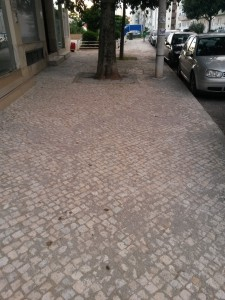
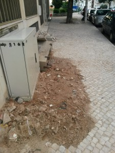
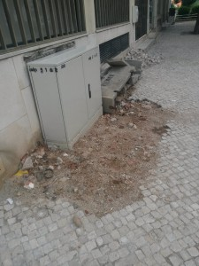

Em Portugal há uma espécie de mania de nunca acabar as obras.

### 1\. Uma secção do passeio

O passeio no meu bloco de prédios estava francamente deteriorado por causa das raízes das árvores, pequenos afundamentos devido ao fluxo de águas por debaixo do empedrado, etc. É natural que aconteça com o tempo.

O que já não acho natural é que:

1. tenham feito obras apenas num espaço de cerca de 20 metros cobrindo parte da fachada do meu prédio e parte da fachada do prédio seguinte (pelo menos aí ficou "harmonioso")
2. tenham ignorado os restantes 75% do passeio, nas áreas após esses 20 metros
3. **tenham deixado a área intervida toda cheia de terra** por cima do empedrado, terra esta que nem a chuva a leva, e que entra pelo calçado, mesmo em sapatos fechados, de quem passa
4. e isto foi há uns meses... finalmente liberto isto que tinha preso na garganta...

Não sei se foi a Junta de Freguesia de Benfica que fez esta obra mas tenho sérias dúvidas que tenha sido encomendada pela empresa que tem as portas para esta badalhoquice (Vision Lab). Muito infeliz deve estar por ter este lindo cenário terceiro-mundista mesmo à porta.

### 2\. A caixa de eletricidade

De manhã estavam a fazer obras na caixa de eletricidade à porta do prédio e fiquei contente pois a caixa que lá estava tinha um ar pouco saudável e já era bastante antiga; tendo tido alguma obra paga pelo prédio para arranjar o chão à sua volta, que estava meio afundado e a permitir grandes infiltrações de água nas arrecadações adjacentes.

Claro que quando regresso ao fim do dia vejo que deixaram o chão todo partido, com blocos de cimento partidos do suporte da antiga caixa e... uma caixa novinha em folha.

Vá, se calhar não tiveram tempo... mas pelos vistos uma semana não chegou, pois uma semana depois... estava igual...

Semana esta com chuvas, e mais ainda devem aparecer, logo daqui a pouco há inundações novamente, sem dúvida.

Pergunto-me quem pagará os danos causados, a EDP? Pois... claro...
