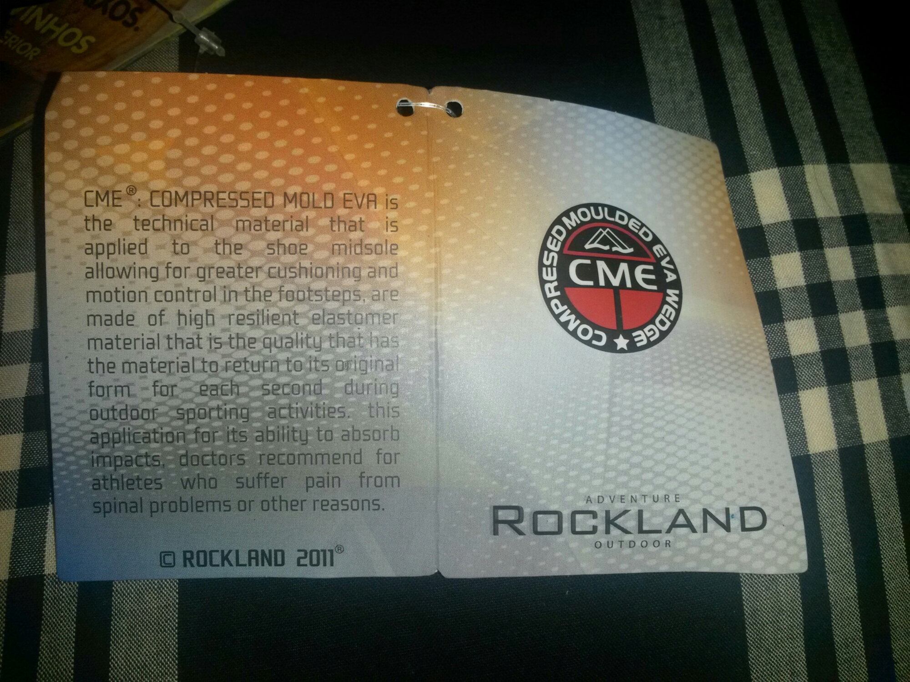
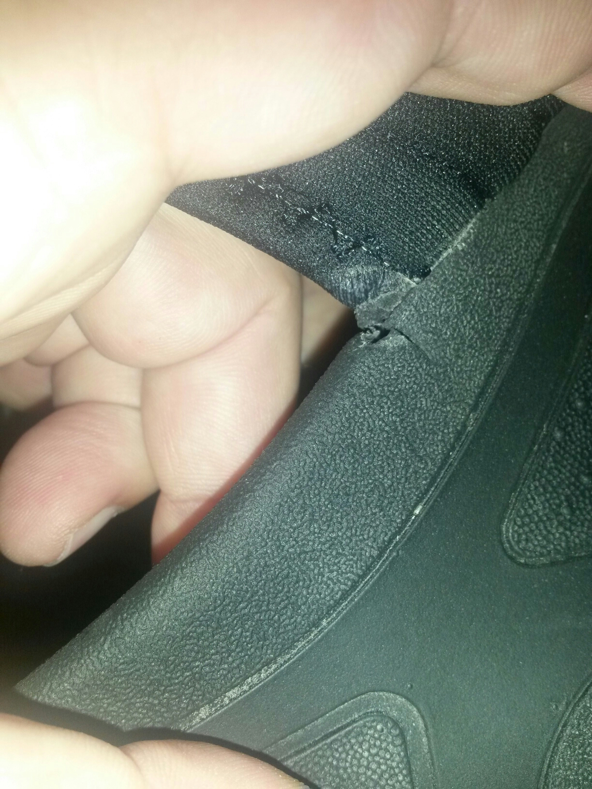

I've been jogging to and from work everyday, averaging 75 minutes on two near 4 Km daily journeys always on sidewalks and zebra crossings.

After 3 weeks I noticed my absolutely fabulously comfortable Rockland sandals were both torn in the same spot,  symmetrically.

I went back to the store and they were very nice and replaced them with another pair.

Today, I used the new pair for the first time and as I got home I noticed that, again and yes again on the very same fucking spot one of them is already torn and the other one shows clear signs that tomorrow it won't last the morning jog before being torn as well.

There is a coloration deformity that promises that will happen, for sure.

72 fucking minutes of jog!

Now... Some of you, dear readers, may think sandals are not made for that. You're wrong. These ones are for that. Read on:

«made of **high resilient** elastomer material that is the quality that has the material to **return to it's original form** for each second during **outdoor sporting activities** (...) recommended for athletes»

Well, I guess Rockland means torn sandals soles, by that.

They've got some explaining to do...
