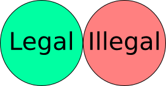
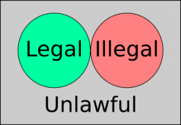
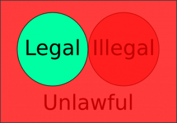

I'm all in for Net  Neutrality, but insofar as it meaning that those who control connectivity will not control what you do with the connectivity you're renting.

You pay for 100 Mbps, and **of course**, you should have read you're getting that to the ISP, not to each and every website on the Internet.

You **should never** be subject to an ISP's whims (possibly because they might also be a content provider) meaning they should not make traffic **slower** from a nom paying, non complying service provider.

**This does not mean** that the service provider should be forbidden to buy closer access to the ISP's clients, that's how all the web accelerators (eg Akamai) work.

However when I read Obama's Net Neutrality speech I was scared shitless of what he said. I don't want that.

Now you may say I'm not an american citizen, but the thing is... they influence politics abroad so much that inevitably what they do may be done **worse** in Europe.

As an example, DMCA was made **much worse** in Europe's own EUCD. I now own  several DVD's which if I play with Free Software I risk up to **two years in jail** (which is why DVD DRM only made me **not buy any DVD media since 2004**, so **DRM actually meant less revenues** to content providers).

What scared me shitless in Obama's speech? His definition for "**ISPs must not block content**". Below are [**his words to the FCC**](http://www.whitehouse.gov/net-neutrality), not mine:

> **No blocking.** If a consumer requests access to a website or service, and the content is legal, your ISP should not be permitted to block it.

«**_(...) and the content is legal_**» is what scared me shitless.

When people read "legal", this is what they think it means:

But **illegal** content is already forbidden in several places, for example **hate speech**. So what is new here? Surely you have nothing to hide, right?

Wrong! Very wrong! Legality is not a mutually exclusive dual state, it is a mutually exclusive **triple** state between what's...

- **legal**, meaning explicitly **allowed** by law, green stuff
- **illegal**, meaning explicitly **forbidden** by law, red stuff
- **unlawful**, meaning **not forbidden** by law but also **not explicitly made legal** by law, grey matter

This, in short:

Obama's words mean that **only that green circle** cannot be blocked by ISPs, here is **what can be blocked by ISP**s, according to that definition:

Ok now, please tell me which of the following is explicitly allowed by law:

- Bit torrent
- Blogging, podcasting, vidcasting \[without a license\]
    
- Wikileaks
- Snowden-like leaks

You will not be able to uphold these things on the basis of free speech, as they can be argued to **hurt the network**, or **treason**, or some other excuse that will be very hard to fight in courts if you allow this.

EFF, EDRi, everybody, can **we please** agree that politicians have **pwned** the Net Neutrality debate and are on a **power grab** attempt to control what citizens can access to on the Internet?

I have to thank the [No Agenda](http://www.noagendashow.com/) podcast for helping me perceive this, as they have pointed this orwellian speech so many times in other politicians's words before [Obama's words ever got posted](http://www.whitehouse.gov/net-neutrality) in the WhiteHouse.gov web site.

I'm sure the EU will soon follow...
