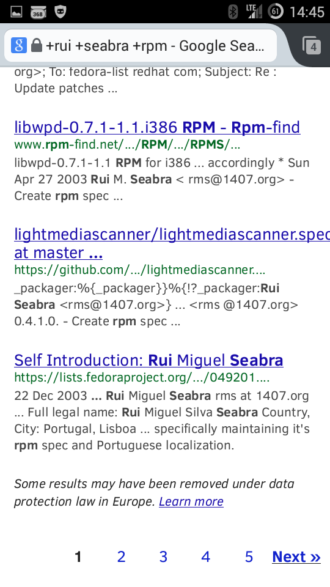

Very, very disturbed to have found potential evidence of the "power to be forgotten" maybe having been abused in my name when I searched for my short name along with rpm.

[Google search for +rui +seabra +rpm](https://www.google.pt/search?q=%2Brui+%2Bseabra+%2Brpm)

