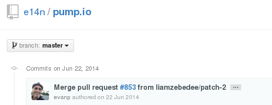

For years I've been bravely maintaining a pump.io instance residing at https://p.1407.org/ even though the project has some unhealthy red flags, the most important of which are no development community and definitely not even great involvement from its own father.

I think Evan is an awesome guy, but sadly pump did not gain traction. I'm afraid of running web software that is so unmaintained.

I don't believe it is secure, no software is, specially secure enough to go on for almost an year without patches (and let's not dwelve on how few there had been previously):

It's not lightly that I do this, and it's actually with a lot of sorrow that I'm retiring it.

It's html5 web interface means it's very hard to make a static version, and I've never shared anything so significant in it that I'll be sad to let it go.

I'll keep a backup but, I'm sad to say, I simply can't take it anymore and it's time for much due housekeeping. :(
