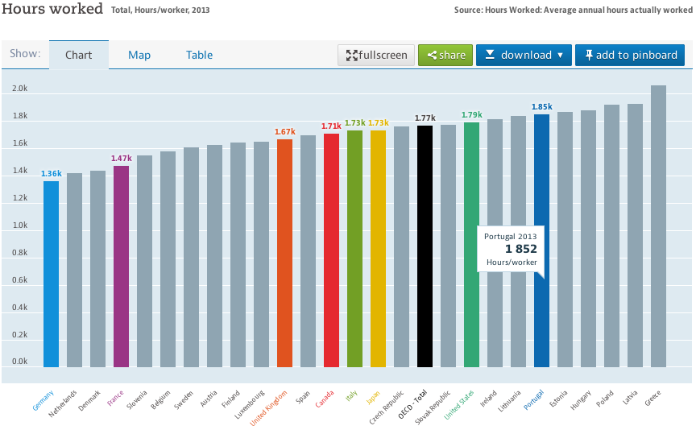

Ooo... sorry for shouting. I hope I haven't hurt your ears, specially if you enjoy that mantra about lazy Portuguese. Actually... the most people I hear it from are right-wing nuts parroting The Message their idols injected in their puny minds.

Here it goes, [from OECD](https://data.oecd.org/emp/hours-worked.htm) and restricted to the EU countries so it's easier to understand:**One thousand, eight hundred and fifty two hours per year** on average.

(Yes, I didn't notice the graphic included other countries, I thought the EU filter reduced, and it did, the list of countries but it didn't remove explicitly selected countries, I'll fix that later)

_Aha_, your neo-liberal devil whispers in your ear... _in averag__e... now we got him!_

Well, the definition of work for this graphic is:

> Average annual hours worked is defined as the total number of hours actually worked per year divided by the average number of people in employment per year. **Actual hours worked include** regular work hours of full-time, **part-time** and **part-year** workers, paid and unpaid overtime, hours worked in additional jobs, and exclude time not worked because of public holidays, annual paid leave, own illness, injury and temporary disability, maternity leave, parental leave, schooling or training, slack work for technical or economic reasons, strike or labour dispute, bad weather, compensation leave and other reasons. The data cover employees and self-employed workers.

So this actually means that should you only consider full time jobs it would be an even higher value... and it's not counting with "too many holidays", or strikes, or whatever.

Reality calls, people...

(via [Jan Wildeboer](https://plus.google.com/+jwildeboer/posts/EiwYghiN8VQ))
