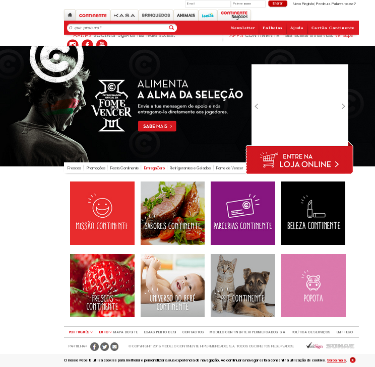
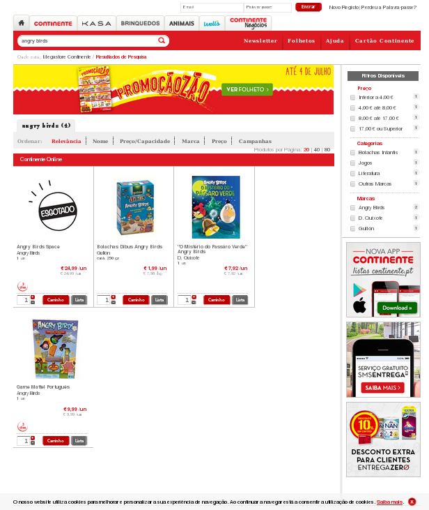

A cadeia de supermercados Continente tem estado com uma campanha associada aos Angry Birds que é, na minha opinião, **publicidade enganosa** e por isso uma violação do Artigo 11º do [Código da Publicidade](http://www.pgdlisboa.pt/leis/lei_mostra_articulado.php?nid=390&tabela=leis&nversao=).

As fotografias tiradas foram **sem autorização**, mas considero de maior relevância a documentação que sustenta a minha opinião.

Primeiro, as cadernetas:

«_Junta os selos e coleciona os teus peluches_» implica que o sujeito são os peluches na frase seguinte: «_Com 20 selos 2.99 € cada_». O português parece-me claro, exceto para o Continente, representado pelos coordenadores de área, de segurança e de uma suposta advogada do Continente através de uma suposta conversa telefónica que o coordenador de segurança supostamente teve.

Depois, o resumo do regulamento confirma o entendimento \[de notar que à data da fotografia, o stand visível **não tinha nem verso nem segunda folha**, pelo que nem me ocorreu fotografar esse facto\]:

Efetivamente o que diz é:

> Os selos, depois de colocados na caderneta, servem para os Clientes adquirirem por um preço extraordinariamente baixo os 10 (dez) Peluches Angry Birds selecionados exclusivamente para a Campanha.

Factos identificados:

- **na caderneta** (singular)
- **um preço extraordinariamente baixo** (os tais «**€ 2.99 cada**» quando se completam os 20 selos compõem-se um preço extraordinariamente baixo, um a 2.99 os restantes a 15 \[estimo, não sei o valor\], já não se pode entender como extraordinariamente baixo)
- **a ausência de qualquer limitação a um boneco por cada caderneta**

Hoje, as caixas dos peluches ainda indicam a mesma informação:

De notar o facto curioso de se ver numa das caixas um autocolante a dizer "um peluche". No mínimo, quando há preço distinto em dois locais, reverte a favor do cliente, ou seja, seria utilizado o preço mais barato. Mas foi aqui que comecei a suspeitar que iria ter de lutar para satisfazer a custo razoável os desejos do miúdo.

Chego então à caixa, e começam por me exigir as cadernetas \[plural\]. Percebi logo que ia mesmo ter de haver um _happening_ e que a pessoa que me atendeu não tinha culpa nenhuma tendo solicitado que chamasse alguém com autoridade.

Veio uma pessoa que não se identificou (e não consegui ler o crachá), que repetiu a informação **contraditória em relação ao publicitado**, pelo que lhe exigi que fosse buscar alguém com autoridade.

Reparei que apesar de se ter afastado, volta e meia ia espreitando para ver se eu já tinha ido embora. Apenas na sequência de três verificações se ainda lá estava, é que finalmente veio a coordenadora de área, Margarida Delgado, que repete a mesma informação.

Após trocarmos argumentos, onde eu leio e cito as cadernetas e a informação que havia no stand originalmente fotografado, ameaça que eu tenho de escolher um e que vai mandar retirar os restantes da caixa.

Eu rejeito isso, insisto em pretender ser satisfeito de acordo com o que foi publicitado e que não deixo que retire nenhum boneco.

Na sequência disto, chama o coordenador de segurança, Leonardo Tenente. A ameaça implícita é evidente: sou um ignóbil vilão que está a colocar em causa a segurança de alguém, mas não me deixo intimidar.

Quando começam os dois a dizer que a interpretação é minha e que eu é que estou errado, eu desabafo que se não entendem português corretamente, então o problema não é meu e aqui o coordenador de segurança sai-se logo com «está a chamar-me de incompetente?», algo que imediatamente refutei cabalmente: não o fiz, nem rocei minimamente o tema da competência de seja quem for, se alguém o fez foi o próprio coordenador.

Eu mantenho a minha posição e solicito, tendo sido negado várias vezes, que me apresentem provas que contradigam as que possuo.

Chegam a mencionar o site, mas se formos ao site do Continente eles hoje não têm nada na página principal:

E se utilizarmos o campo de pesquisa procurando por «Angry Birds» verifica-se que também não se encontra nenhuma informação:

Talvez exista algum link obscuro com essa informação, mas a verdade é que não está evidente em lado algum, e o que está evidente nas cadernetas e nas caixas é o "preço extraordinariamente baixo" e "com 20 selos, 2.99 € cada"

Durante cerca de uma hora é uma repetição desta troca de argumentos, perante uma muito infeliz pessoa na caixa que acaba por ter de ser trocada por chegar a hora do almoço.

Depois de uma suposta conversa telefónica que o coordenador de segurança supostamente teve com uma suposta advogada do Continente (não assisti a nada) decidiram-se finalmente a trazer-me as provas que tinham, e trazem-me um stand como o fotografado acima:

De notar que, tal como na fotografia acima, **nada neste documento indica ter qualquer verso ou folhas extras**, mas a verdade é que este stand tem uma segunda folha virada para o lado **que não está visível para os clientes** e que tem um texto alternativo que agora fala em "um peluche".

Nada para mim me convence que não tenham impresso esta folha enquanto me enrolavam uma hora à espera.

Mesmo que existisse esta segunda folha neste stand e no outro não (sim, foi num Continente diferente), **em nenhum caso está visível para os clientes**, pois uma pessoa normalmente não pega nos stands e nada na face visível dava indicações para ler o verso. Eu fi-lo por precaução no primeiro caso, e no segundo virei-o com confiança e vejo a segunda folha com texto distinto.

Perante este cenário, desisto, não levo nem um único Angry Bird e opto por ir para casa. Mas não sem deixar uma reclamação oficial que espero que seja levada a sério pela ASAE, e não sem documentar esta situação publicamente com o intuito de alertar outros para o que para mim não passa de **publicidade enganosa** que o Continente levou a cabo.

E pelos vistos não fui o único a deparar-me com isto, [há uma lista extensa de casos iguais no Portal da Queixa](http://portaldaqueixa.com/pesquisa?q=angry%20birds).

Para concluir, já agora, sai uma dica para quem não fez as contas: aceitando as regras do Continente, sai mais barato comprar os bonecos a € 7.99 com caderneta dedicada de 10 selos do que comprar a € 2.99 com caderneta dedicada de 20 selos.

Aproveitem se quiserem, eu por mim já vou ter de explicar ao miúdo que não os vai ter todos, não vou inventar compras sem necessidade apenas para completar uma coleção idiota de peluches, porque o Continente andou a enganar as pessoas.

PS: ainda tive uma outra ameaça do coordenador de segurança, que eu estava proibido de utilizar o nome dele. Segundo o próprio uma suposta recomendação da suposta advogada com quem supostamente falou. Só respondi ao senhor Leonardo Tenente que o fascismo em Portugal acabou em 1975. Tenho liberdade de expressão e meramente estou a relatar o que se passou e com quem interagi de forma relevante nesta situação.
