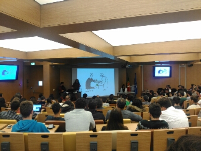

When did the great Richard Stallman start using slides?

Well, I don't mind, they're cute and funny!

"Should we have more surveillance than the USSR?" is a highly recommendable talk!

I'll update this post later with more photos.
