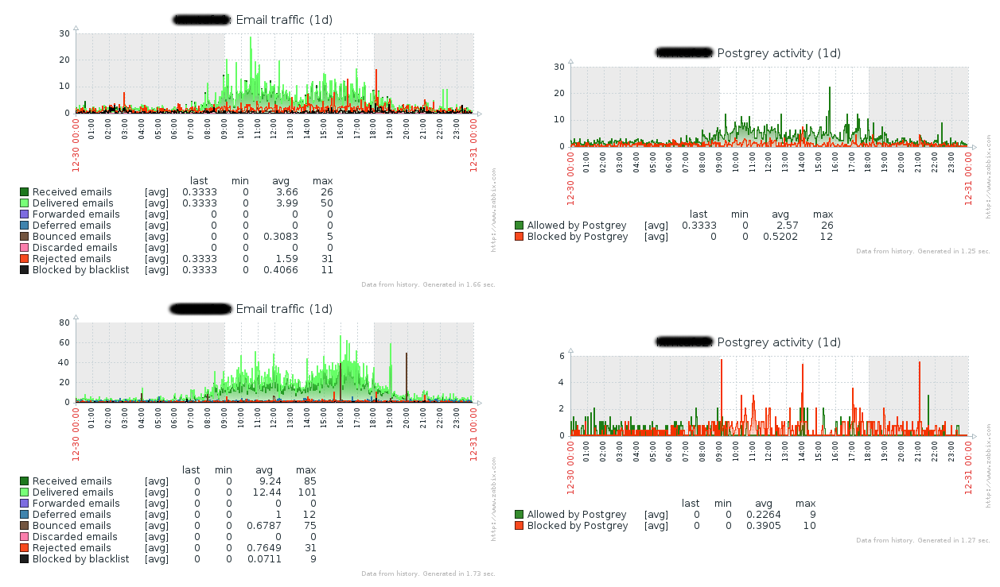

Today's Zabbix templates are for [Postfix and Postgrey](https://github.com/rseabra/zabbix-templates/tree/master/postfix) (but separated in case you don't use both).

Since I run a moderate volume set of email servers, I could probably have Zabbix request the data and parse the logs all the time, but why not do it in a way that could scale better? (yes, I know I have 3 greps that could be replaced by a single awk call, I just noticed it and will improve it in the future).

I took as base a few other examples and improved a bit upon them resulting in the following:

1. A **cron job** selects the last entries of _/var/log/maillog_ since the previous run (uses **logtail** from package **logcheck** in **EPEL**)
2. Then **pflogsumm** is run on it as well as other queries gathering info not collected by pflogsumm (in my case, postgrey activity, rbl blocks, size of mail queue)
3. Then **zabbix\_send** is used to send the data to the monitoring server

The cron job gets the delta t you want to parse the logs, in my case it's -1 as I'm going it per minute and that's an argument to find ... -mmin and you'd place it like this:

\* \* \* \* \* /usr/local/bin/pfstats.sh -1

This setup will very likely require some adaptation to your particular environment, but I hope it's useful to you.

Then you can make a screen combining the graphics from both templates as the following example:

