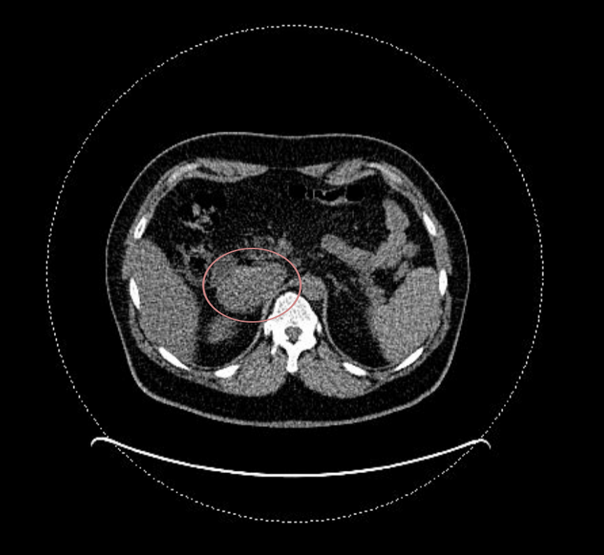
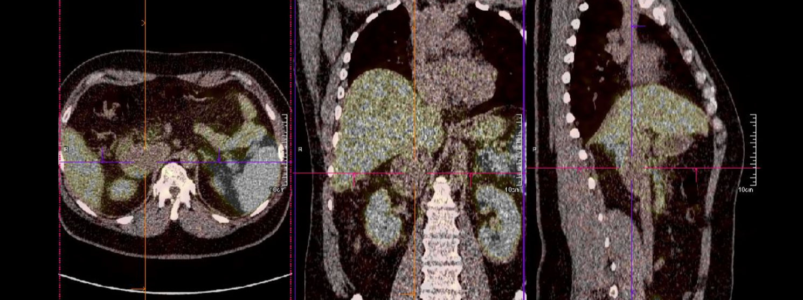
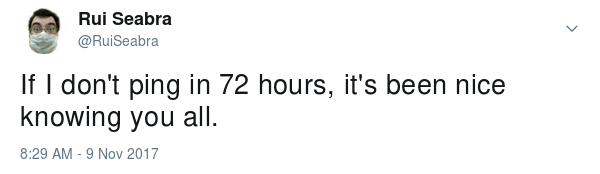
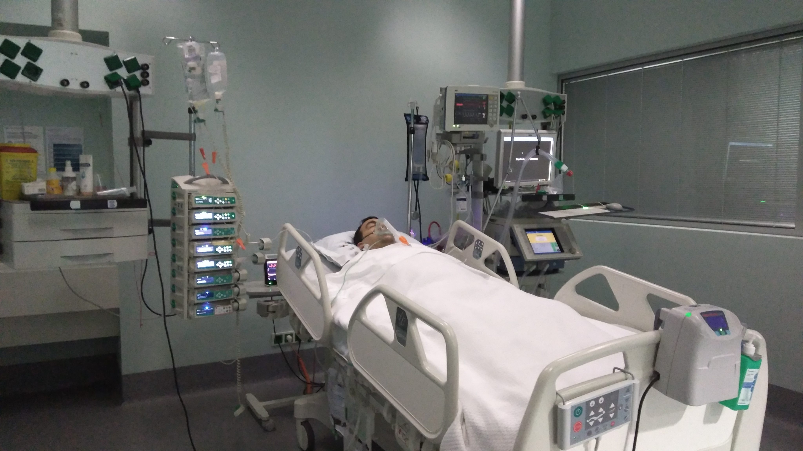
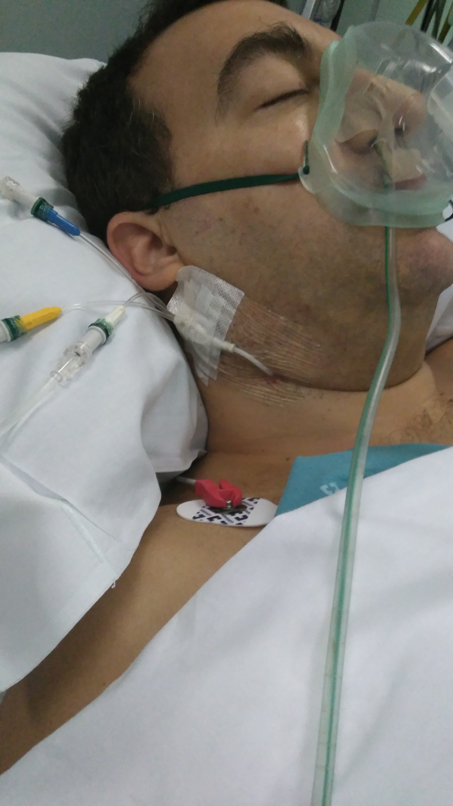
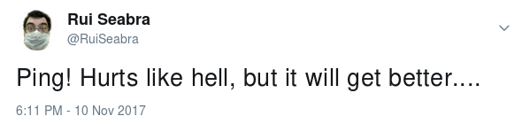
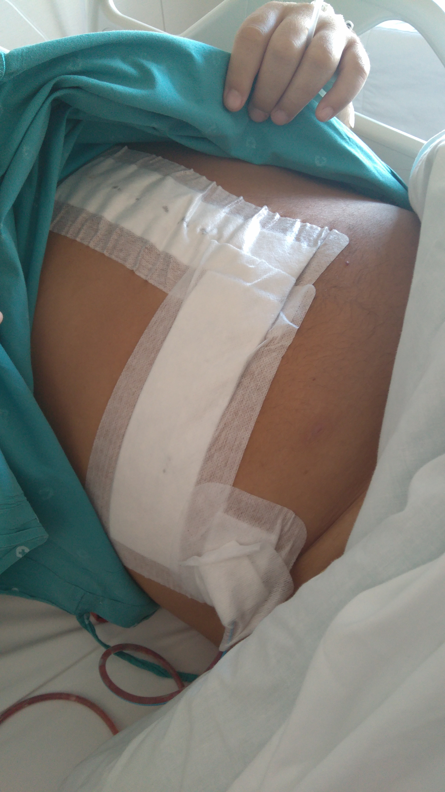
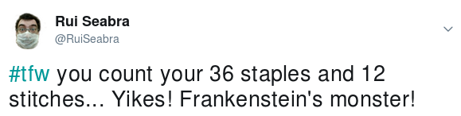

Back in May 29th I woke up fresh, well humoured, proceeded to have a shower and just afterwards, as I dried myself, in a matter of naught but a couple of seconds I thought an explosion had gone off in my head, the strongest headache I ever felt fired up and left me unable to do anything, having to wake up my family to take me to the big H, fearing the worse (stroke, or something worse entirely).

This post will have some gore imagery but it won't be automatically displayed, you'll have to click the images in order to view them. It was so traumatic to me that I need to do this as a sort of catharsis.

**WARNING: it is long, and it's mean, and VIEWER DISCRETION IS ADVISED.**

Soon after entering the hospital I went into triage, my blood pressure was checked and, as I strained to open my eyes and see why the machine was sounding an alarm, it was at 200/120 (sys/dia). Very likely an extreme hypertensive episode.

Medication was provided, blood and urine were sampled for analysis, I got better and had an appointment scheduled for post urgency follow up.

This is where I met Dr. House (kidding, but I wonder...), he set me up for a plethora of blood and urine samples, but as they were being printed and he kept looking at the first sample results he then said to me...

> This is rare but we should check out a couple more tests to see whether you have a problem in an adrenal gland...

... and he added a few more tests , in handwriting, to the just printed prescription as well as prescribe me some blood pressure medication.

A few days of the prescription and I am pleased to finally see blood pressure that is considered normal, rather than a bit high.

I do the tests, including a very bad night with 24 blood pressure map, and then came back to a new follow-up appointment. The doctor just looks directly to the tests he added and says...

> You have a problem in an adrenal gland so we need an MRI to see what's in there.

And it sure looked like it, as there was this big mass between liver and kidney, by the aorta and cava-vein, reasonably close to the adrenal gland. The image below is safe and actually is from a PET scan I took later on:

He thought it to be a [pheochromocytoma](https://en.wikipedia.org/wiki/Pheochromocytoma) and sent me along to another internal medicine doctor for ongoing follow-up of my blood pressure, while the case was taken to the hospital board, and from then on I was handled very, very, carefully.

Next an endocrinology appointment... I didn't even bother scheduling it, they just called me and asked if the time was right for me. Sure enough. Let's go.

It appears there's a different opinion from endocrinology, they believe it to be a [paraganglioma](https://en.wikipedia.org/wiki/Paraganglioma), and want me to do a PET scan with gallium 68 to look for more. Yup, there could be more, and if so it would be better to take them all at once rather than in multiple surgeries.

Fortunately, the previously shown mass was the only one, now shown with colours and lines pointing to the centre of the mass:

Meanwhile, follow-up with internal medicine, where the doctor prescribes me a β-blocker to help muzzle what they believed to be a pheochromacytoma. This actually raised my blood pressure just a few days after I started taking it, and I had a scare of > 180/95, so in contact with the doctor we removed it and the pressure came back to the controlled normality after a few more days.

Apparently, this effect confirmed the paraganglioma diagnose as it's a documented effect with this sort of tumour.

I'm then sent to surgery and anaesthesiology appointments where I'd meet the surgeon who cut the little chest-burster I had off of me and the anaesthetist who, having a speciality in paraganglioma, prepared me for a long period of pre-surgery treatment in order to muzzle the tumour because it could complicate things during surgery.

And by complications we're talking about lowering a **90% fatality rate** (without treatment) to **0.08%** (with carefully followed treatment). Still 8 more cases than I'd like to think about but the drugs could be heroine for all I cared, just shoot it up my veins, please!

Fortunately it was a matter of having an α-blocker and a β-blocker taken in growing dosage until blood pressure and heart rate were very, very low.

I felt so weak for a few weeks... for example I had to climb up stairs 4 to 5 steps at a time, otherwise I'd be dizzy from lack of oxygen in my head, and even a short steep ramp would be a huge cause of  concern, to me...

After a few weeks of this treatment, the anaesthetist considered  we had reached a satisfactory target and gave the go order, just a couple of days before the scheduled surgery date.

And so the day arrived... just before I turned my phone off I called my wife to tell her I love her, and to leave a last warning as I knew this would be a risky procedure. Dramatic, I know, but that's how I felt... I gave a margin because I didn't know whether I'd stay only one night in ICU as predicted or if I needed two:

At the OR the surgeon informed me their expectations of using [laparoscopic surgery](https://en.wikipedia.org/wiki/Laparoscopic_surgery) were too optimist so they decided not to even try it and just go straight to [laparotomy](https://en.wikipedia.org/wiki/Laparotomy) (ouchie, I thought, but ok, whatever, just take it off).

Then, I woke up (well, about 3/4 of a day to actually wake up) at the Intensive Care Unit, where I had lots of catheters, three in my left hand, an epidural one on my back, on my neck, an algal, and two respiratory tubes, one with additional oxygen and one into the nose through to the trachea.

It most definitely wasn't comfortable:

- I felt extremely dehydrated but could not drink... as much as I would like to, all I was allowed to was to have my lips moistened with a tiny sponge,
- the tube leading into my trachea hurt my larynx (I firstly though it was dry throat but then they showed me it was the tube),
- I knew I had an epidural catheter so I was afraid to move even a millimetre, not that I could hardly move anything at all,
- and felt hurt all over, specially in the abdominal region, even with the pain killers which the nurses very attentively updated frequently and asked if I felt pain in order to increase the dosage

I finally went into my bedroom the following day, as predicted, though nearly at dinner time. I insisted on having my phone in order to make sure I'd let everyone known I was fine:

And here's a picture of my covered wound, the drain tube is visible, you can see how big it is!

For the first few days I felt a bit emotional, every move was so hard to do, and all I wanted was to be left alone watching online videos or other stuff I took with me. I had a few visits from family and friends but really, even talking was a bit hard so sorry if I gave a wrong impression, I just really wanted to be left alone...

On Saturday they took the respiratory tubes, one hand catheter and the neck catheter.

On Sunday they took off the epidural catheter and the algal, so I was left much more comfortable to start moving. So much, in fact, that I even had my first sitting meal, scrambled eggs with cheese (I insisted I wanted a ketogenic diet as I didn't want to ruin myself and they complied), also at my disposal full fat milk and natural Greek yogurt, as well as having green vegetables accompanying the main meals.

I also started getting up by myself, which was quite a daunting task, but it was either that or risk peeing in bed (even with a pot, spills can happen), so I had a strong motivation.

By Monday, the surgeon was hoping to let me go, but since I had to raise the bed's back area in order to help me get up or back into the bed, which was a crutch I couldn't have at home, I still felt too insecure to be let go, so we agreed to give it one more day.

Finally, it's Tuesday and I'm cleared for getting out. Before leaving, the nurse replaced my wound cover and I took a picture...

You can view the [uncovered wound (warning: gore-ish, maybe nsfw) by following this link](https://blog.1407.org/wp-content/uploads/2017/11/my-belly-with-staples-and-stiches.jpg). _Don't bother correcting my count if it's a little off, I don't really care :)_

Then I finally got out.

I had asked my soulmate to take me to a hairdresser in order to have my head cleaned (5 days without shampoo) and massaged (it itched and felt uncomfortable). Even though the new cover is water resistant, I'd rather have one first high quality hair wash without fear of wetting the cover. And it felt so, so very relaxing!...

The following day I received the pictures from the removal, but I suppose only [the tumour (warning: gore-ish, maybe nsfw) is actually worth it](https://blog.1407.org/wp-content/uploads/2017/11/the-tumour.jpg).

As one could see in the PET scan above, it's quite big! Also, being well formed and not connected to the other organs lends to a very good prognosis, although if it's confirmed to be a paraganglioma it may be tricky to know for sure whether it was benign or not.

What matters is that it's out, the risky procedure was excellently well done by very good professionals I'm very grateful for, and all the rest of the staff (nurses and help) deserve a lot of praise too.

Now I have to recover with movement, that is... if I stay very still the healing may be quicker but it will be harder to go back to normal, so I have to rest (more like avoid stress and don't do efforts for a couple of weeks) but I have to walk around.

It still feels very weird but an abdominal belt is helping me move more confidently.

The rest is time.

Thank you for reading, even though I wrote a lot about a very personal, private, and traumatic experience, telling this account of the event has been very cathartic, and I needed it.
