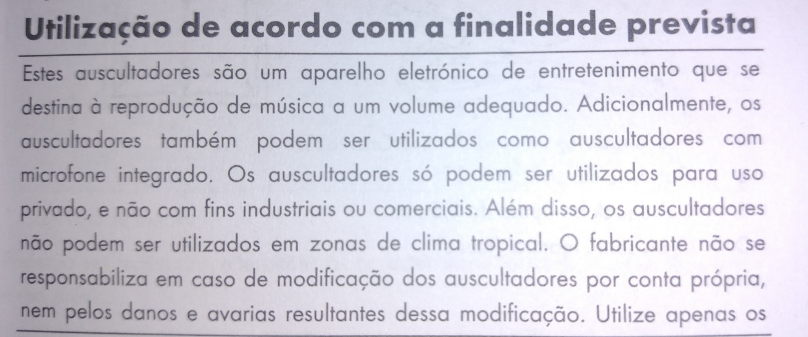
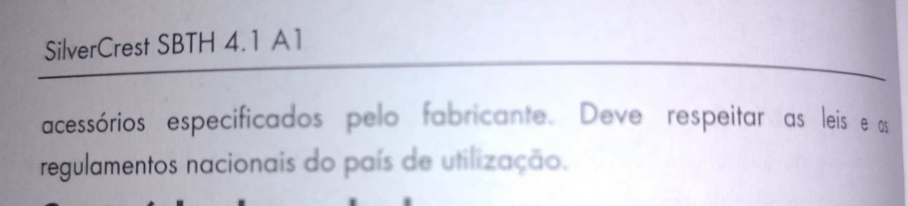

Caros Lidl e SilverCrest,

Gostei muito dos auscultadores que comprei esta semana na vossa loja mas fiquei a-bis-ma-do com a vossa falta de vergonha e muita lata:

> «Os auscultadores **só podem ser utilizados para uso privado, e não com fins industriais ou comerciais**.»

O quê? Mas a que propósito se acham sequer com coragem de declarar isto? É vergonhoso que achem isto correto!

Depois desta falta de vergonha, ainda têm a distinta lata de terminar com a seguinte frase ao virar a página, na mesma secção:

> «**Deve respeitar as leis** e os regulamentos nacionais do país de utilização.»

Olha, ninguém quererá mesmo saber disto, eu por mim estou só a dar um desabafo e vocês, Lidl e SilverCrest, seguramente nem querem saber.

A verdade é que eu estou satisfeito com o produto e vocês ficaram satisfeitos com o dinheiro.

Só não dou o devido uso a este papel porque prefiro algo muito mais fofinho, está bem? :)
