Today I'm going to share with you a powerful fat bomb meal very friendly to people living a healthy keto diet, a scrambled eggs recipe I've been having sometimes that just takes me to heaven.

I known you have to like some of these ingredients, specially roquefort cheese **which is not legally available in the USA because of unhinged law makers** although you may be able to find it at some place under the counter (if you wink-wink, nudge-nudge the right way of course). Sorry guys, try other replacements, it may still be good for you!

Here it goes, first the ingredients (remember to get the most from so called _organic_, _grass fed_, _free range_,or whatever... sources that are less likely to have the sweet poison of sugar or other potentially dangerous chemical additives):

- 3 eggs per person (or for two if you eat less, or for many if you share as an appetizer)
- emmental cheese
- roquefort cheese
- hot sauce (make your own, preferably), I like it quite hot
- a pinch of salt
- coconut oil (cold extraction)
- salted butter
- and optionally, bacon (in this case I had to finish three slices of bacon before they went bad, but the meal is quite awesome without it too)

Start by preparing a good amount of diced emmental cheese:

[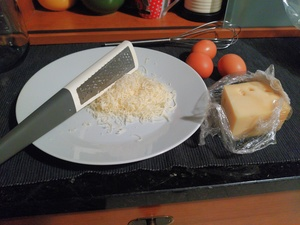](https://blog.1407.org/wp-content/uploads/2018/02/IMG_20180217_200623.jpg)

The, cut a good slice of roquefort cheese...

[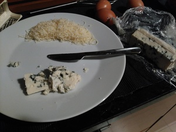](https://blog.1407.org/wp-content/uploads/2018/02/IMG_20180217_200858.jpg)

... and dice it into small pieces:

[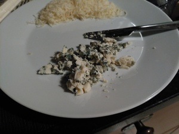](https://blog.1407.org/wp-content/uploads/2018/02/IMG_20180217_200945.jpg)

Then, open your eggs into a cup (one by one in a helper glass, check their smell) and add both a pinch of salt as well as as much hot sauce as you want (I used two tea spoons of my own):

[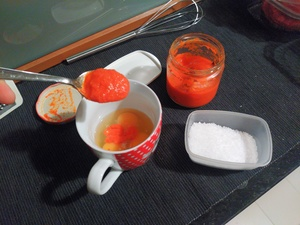](https://blog.1407.org/wp-content/uploads/2018/02/IMG_20180217_201414.jpg)

Give them a good vigorous wisk until it's all very well mixed together:

[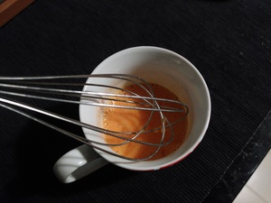](https://blog.1407.org/wp-content/uploads/2018/02/IMG_20180217_201616.jpg)

Finally put a decent amount of butter like between 20 g and 30 g (a good butter to buy in Portugal is Milhafre dos Açores) and a tablespoon of coconut oil in a frying pan:

[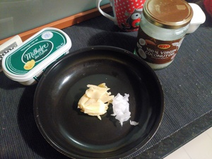](https://blog.1407.org/wp-content/uploads/2018/02/IMG_20180217_201930.jpg)

Now that you have everything ready...

[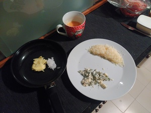](https://blog.1407.org/wp-content/uploads/2018/02/IMG_20180217_202353.jpg)

... it's time to put the frying pan on strong fire and let it melt, mix, and get a quite hot:

[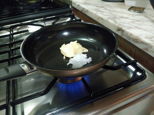](https://blog.1407.org/wp-content/uploads/2018/02/IMG_20180217_205057.jpg) [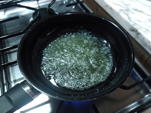](https://blog.1407.org/wp-content/uploads/2018/02/IMG_20180217_205226.jpg)

At this point, I added my slices of bacon, let them fry a bit and then set them on a plate aside:

[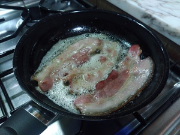](https://blog.1407.org/wp-content/uploads/2018/02/IMG_20180217_205500.jpg)

Then I poured in the eggs and let it solidify just a bit:

[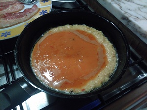](https://blog.1407.org/wp-content/uploads/2018/02/IMG_20180217_205604.jpg)

It's now time to lower the fire, break these eggs and spread the emmental cheese:

[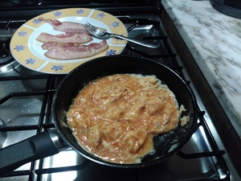](https://blog.1407.org/wp-content/uploads/2018/02/IMG_20180217_205633.jpg) [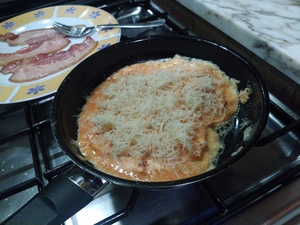](https://blog.1407.org/wp-content/uploads/2018/02/IMG_20180217_205713.jpg)

Now spread the roquefort cheese over (if you had mixed the roquefor cheese along with the eggs, you'd get green eggs, maybe not very appetizing):

[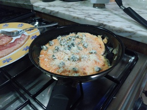](https://blog.1407.org/wp-content/uploads/2018/02/IMG_20180217_205805.jpg)

Let the cheeses melt a bit (you can probably cover the pan in order to let them melt better than in these photos) and serve to a dish preferably with the eggs still bit runny, either on top of (easier) or under (looks nicer) the bacon slices we saved up earlier:

[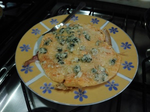](https://blog.1407.org/wp-content/uploads/2018/02/IMG_20180217_205952.jpg) [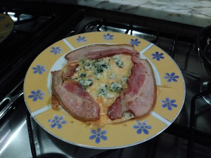](https://blog.1407.org/wp-content/uploads/2018/02/IMG_20180217_210044.jpg)

It's now ready for eating straight away and while it's still hot.

Enjoy the yumminess!
