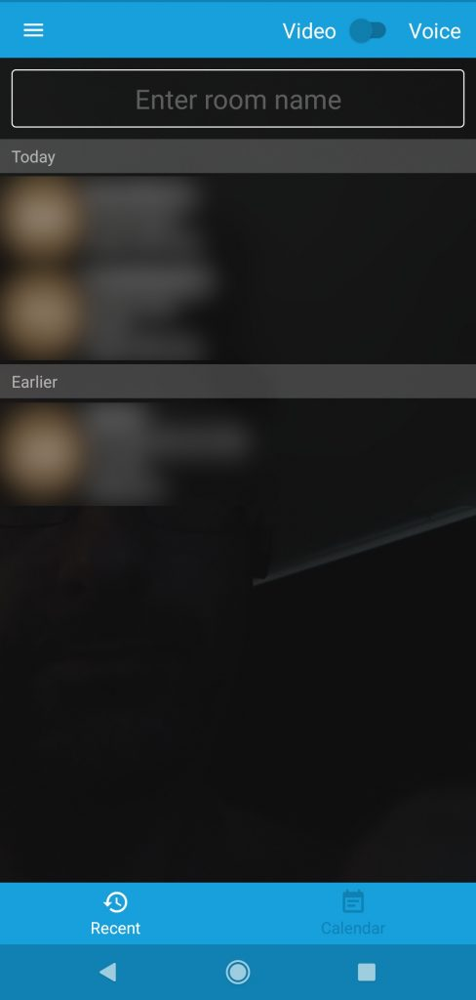
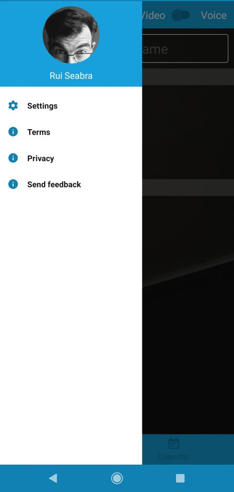
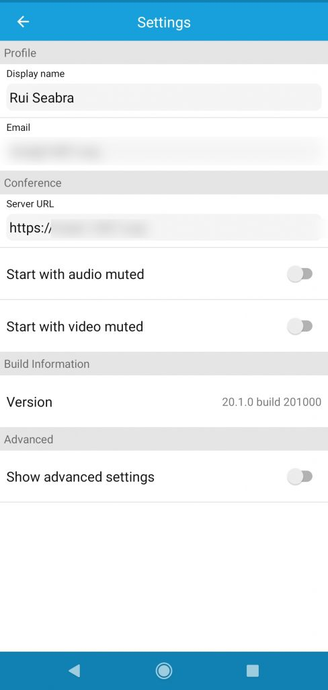

So you have now setup your own Jitsi site, or you want to connect to your friend's Jitsi site. How to do it?

If you're using a computer, it's simple: all you need is to type the address of the website and room in your browser's url bar: **https://your.jitsi.website/SomeFancyRoomEatingIcecream**

But if this was all to it, then it would be a very boring short blog. :) What about the app?

At least for the Android version, Jitsi Meet doesn't make it **easy** to change the server, although it's quite easy, it could be a lot simpler.

Just press the "menu" button (the **three horizontally stacked bars** on the top left part of the Jitsi Meet app window):

Choose **Settings**:

Then choose your display name and, **most importantly**, the website (without any room reference, just the root):

Done. Now go back and write your desired room name.

That's it, that's really just all there is to it.

Now go and have fun. :)
